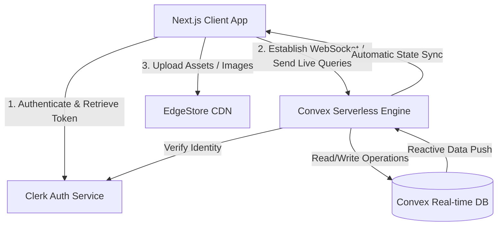

# 🌌 Space — A Real-Time Connected Workspace

Space is a high-performance, real-time connected workspace and collaborative document editor modeled after Notion. Designed with a modern, responsive user interface, it provides users with a seamless editing experience featuring recursive page hierarchies, drag-and-drop cover image management, emojis, and live document publishing.

---

## 🏗️ System Architecture & Data Flow

Space is built on a serverless, real-time data sync architecture that replaces traditional REST APIs with live WebSocket queries.



### 🔄 Real-Time Synchronization Lifecycle
1.  **State Mutation**: When a user types in the rich-text editor or changes page attributes (title, icon, cover), a Convex mutation is invoked.
2.  **Conflict-Free Execution**: Convex runs operations sequentially on a serverless transaction log, ensuring predictable document state.
3.  **Reactive Pushes**: Any change to the database is instantly pushed back to all active client query connections over WebSockets, updating the UI reactively without polling.

---

## ⚡ Technical Implementations Deep-Dive

### 1. Hierarchical Recursive Document Engine
Documents in Space are organized as a tree hierarchy where any document can contain sub-documents.
*   **Database Schema**: Modeled via a self-referential reference `parentDocument: v.optional(v.id("documents"))`.
*   **Recursive Sidebar Fetching**: The `documentList.jsx` component recursively loads nested pages dynamically, keeping memory overhead low by lazily fetching and rendering nested directories only when expanded.
*   **Cascading Actions**: When a parent document is archived, a recursive mutation (`recursiveArchive`) in `convex/documents.js` traverses the tree and marks all child documents as archived, ensuring state consistency.

```
📁 Root Document (User Space)
│
├── 📝 Meeting Notes
│   ├── 📎 Action Items (parentDocument: Meeting Notes ID)
│   └── 📎 Retro Minutes (parentDocument: Meeting Notes ID)
│
└── 📁 Q3 Roadmap
    └── 📎 Feature Specification (parentDocument: Q3 Roadmap ID)
```

### 2. Secure Document Guarding & Authorization
The application implements strict authorization gates at both the database level (Convex backend) and routing level (Next.js middleware).
*   **Identity Verification**: Every mutation/query retrieves the user's Clerk token using `ctx.auth.getUserIdentity()`. If the user is unauthenticated, operations are rejected instantly.
*   **Row-Level Validation**:
    ```javascript
    const existingDocument = await ctx.db.get(args.id);
    if (existingDocument.userId !== userId) {
      throw new Error("Unauthorized access to document");
    }
    ```
*   **Public Sharing Gate**: Public previews bypass Clerk checks, but only read-only requests are allowed, and only if the page's `isPublished` flag is explicitly set to `true` and the document is not archived.

### 3. Integrated Rich Media Pipeline
*   **Block-Level Assets**: The rich-text editor (built on **BlockNote**) hooks into **EdgeStore** for asset handling.
*   **Dynamic Banner Management**: Users can set cover images. The `cover-image-modal.jsx` uses `single-image-dropzone.jsx` to let users upload banner files. When updated, the old image is deleted from EdgeStore directly via the `.beforeDelete()` middleware bucket rule, optimizing storage usage.

---

## 💾 Database Schema (`convex/schema.js`)

The `documents` table represents the primary database model:

| Field | Type | Description |
| :--- | :--- | :--- |
| `title` | `v.string()` | The display name of the document. Defaults to "Untitled". |
| `userId` | `v.string()` | Owner ID mapped directly to Clerk User ID. |
| `isArchived` | `v.boolean()` | Indicates whether the file resides in the Trash. |
| `parentDocument` | `v.optional(v.id("documents"))` | Self-referential ID indicating parent-child page association. |
| `content` | `v.optional(v.string())` | JSON representation of the BlockNote document content tree. |
| `coverImage` | `v.optional(v.string())` | Public CDN URL hosted on EdgeStore for the page's top banner. |
| `icon` | `v.optional(v.string())` | Selected Emoji unicode representation. |
| `isPublished` | `v.boolean()` | Flag enabling public preview sharing. |

**Indexes Defined:**
*   `by_user`: `["userId"]` — Used for fetching trash items or global search results.
*   `by_user_parent`: `["userId", "parentDocument"]` — Used for constructing sidebar page navigation.

---

## 🛠️ Reusable Component Library & Design

Space implements a modern design system leveraging `shadcn/ui` (Radix UI primitives) and Vanilla Tailwind:
*   **Aesthetics**: Glassmorphism highlights, curated CSS gradients, custom micro-interactions (collapsible sidebar dragging, hover scaling on items).
*   **Theme Integration**: Integrates `next-themes` seamlessly across all components, including the rich text editor which dynamically switches between Light and Dark Mantine-styled themes.
*   **Responsive Layouts**: Collapsible navigation pane built to dynamically resize via mouse dragging, adjusting main layout margins fluidly.

---

## 🚀 Getting Started & Local Development

### 1. Install Dependencies
```bash
npm install
```

### 2. Configure Environment Setup
Create a `.env.local` file in the root directory:
```env
# Clerk Authentication Keys
NEXT_PUBLIC_CLERK_PUBLISHABLE_KEY=pk_test_...
CLERK_SECRET_KEY=sk_test_...

# Convex API Endpoint
NEXT_PUBLIC_CONVEX_URL=https://...convex.cloud

# EdgeStore Keys (File Uploads)
EDGE_STORE_ACCESS_KEY=...
EDGE_STORE_SECRET_KEY=...

# Nodemailer SMTP Keys (for Contact Form)
SMTP_HOST=smtp.gmail.com
SMTP_USER=your_email@gmail.com
SMTP_PASS=your_gmail_app_password
```

### 3. Deploy/Start Convex
Initialize the database client and syncer:
```bash
npx convex dev
```

### 4. Start Next.js App
```bash
npm run dev
```
Open [http://localhost:3000](http://localhost:3000) in your browser.

---

## 📖 Additional Project Documentation
*   [Contributing Guide](file:///Users/vaishnavverma/Downloads/Space/docs/CONTRIBUTING.md) — Local setup steps, script references, code styling guidelines, and PR checklists.
*   [Operations Runbook](file:///Users/vaishnavverma/Downloads/Space/docs/RUNBOOK.md) — Deployment instructions (Vercel & Convex), health checks, diagnostics, common issues, and rollbacks.
